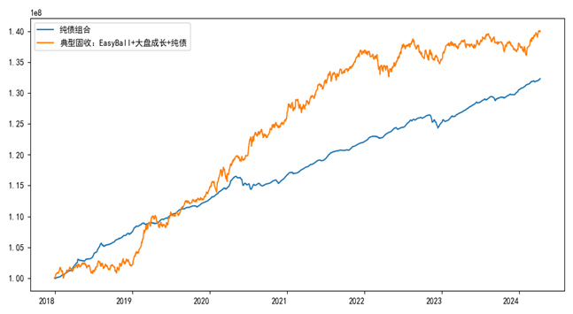

# OnshoreAssetPortfolioTest
解决境内固收+组合回测实务问题的测算方案

捏合择券与配置、体现“现实制约”是我们在固收+策略回测时的两个重要考虑。在《转债量化策略框架2.0与Python实现》，我们更新了转债组合的测算框架与算法。而对于更为宽泛的固收+组合而言，需要解决的是：

1、捏合择券与配置：对于固收+组合，我们面对的不是一类资产，而是流动性、择券逻辑存在一定差异的(至少)三类品种。且每个资产内部也有不同的选择方法，例如股票可以是高股息或成长的，转债可以是等权、双低或者其他策略。而在上一个层级，即资产配置层面，我们也需要测算框架能够反映不同的配比或者配置策略；

2、反映现实制约：不同品种的流动性、交易成本等制约了实际中的效果，我们也希望测算时能够反映出，不同规模的组合，在对应策略上的效果差异。

这里我们介绍一个能满足需求的测算方案。

为兼容不同债、转债、股，以及配置测算，我们的模型的工作流程与细节处理方式如下图：

  
**图表1：固收+组合回测模型的工作流示意图** 

  

关键在于，我们将具体品种内部的择券策略，与资产配置策略分离。输入不同资产各自的择券策略，以及组合整体和资产内分部的权重分配方案来进行组合测算。下面是一个典型的案例，固收+组合A中：1.转债以EasyBall进行组合，EasyBall内等权分配；2.股票选择大盘成长的个股，股票内加权分配；3.纯债用隐含AAA，剩余期限1-3年的信用债。

  
**图表2：一个典型固收+组合的回测代码实现** 

  

**图表3：一个典型固收+组合的净值情况** 

 
注：数据自2017年12月29日至2024年4月9日；其中典型固收+组合2018年以来年化收益5.76%，最大回撤3.14%，年化波动3.12%；纯债组合2018年以来年化收益4.71%，最大回撤1.82%，年化波动0.7%，组合月度调仓，起始组合金额1亿元。
  

此外，实际中我们也需要有对交易成本和资产流动性的考虑。在实务中，我们要看到：a）交易并不免费，这一点我们通过设置交易成本来实现；b）资产流动性制约组合仓位，资产流动性越差，实际组合就容易买不够模拟组合一样的配重。我们的思路是，组合最多只能买到建/换仓日一定比例(例如，10%)的成交（下面的sizeAdjustRate参数）。

  
**图表4：模型考虑交易成本和流动性的实现** 

  

这一限制会造成两个账户即使采用一样的策略，但是账户体量会造成两者表现的差异。下图中，我们回测了此前同样的固收+组合，在不同起始资金情况下，施加建仓约束与否的表现。可以看到在账户规模突破10-20亿元的情况下，组合效率就会大幅缩减。我们可以理解，规模约束调仓难度的同时，也使得赚流动性的钱也更困难。

  
**图表5：账户大小与组合效率情况** 

 
注：数据自2017年12月29日至2024年4月9日，组合进行月度调仓，交易成本为千2，10%换仓日的成交限额
  
